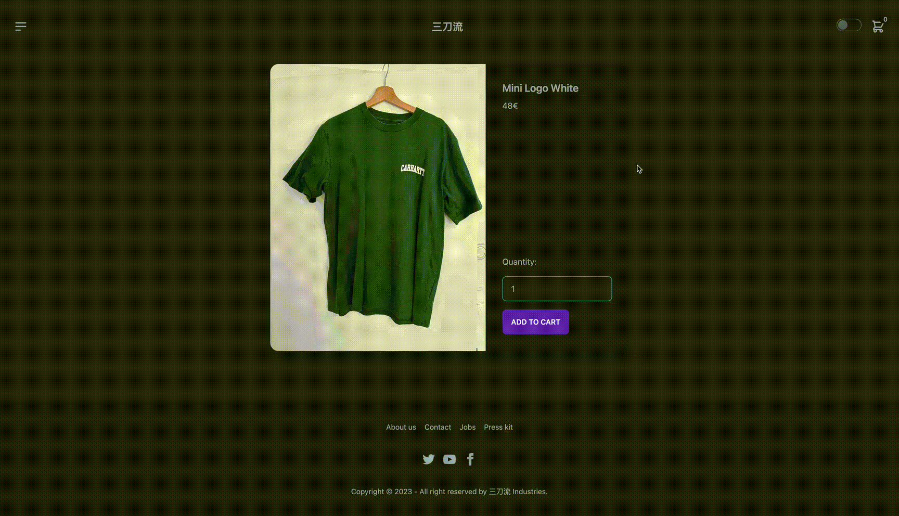

# E-commerce

## Description

This is a simple web application for a fake e-commerce. Users can browse and buy products, manage their shopping cart, and proceed to checkout.

## Technologies Used

- [Next.js](https://nextjs.org/)
- [React](https://reactjs.org/)
- JavaScript
- HTML/CSS
- [Node.js](https://nodejs.org/) (for server-side logic)
- Cookies (for cart management)
- [TypeScript](https://www.typescriptlang.org/)
- [PostgreSQL](https://www.postgresql.org/) (for the database)
- [Ley](https://github.com/lukeed/ley) (for database migrations)
- [Jest](https://jestjs.io/) (for testing)
- [Playwright](https://playwright.dev/) (for end-to-end testing)
- [Tailwind CSS](https://tailwindcss.com/) (for styling)
- [Daisy UI](https://daisyui.com/) (for UI components)

## Screenshots




## Setup Instructions

To set up this project locally with `pnpm`, follow these steps:

1. Clone the repository:

   ```bash
   git clone https://github.com/Markopavleka/next-js-ecommerce-store

   ```

1. Navigate to the project directory:

```bash
cd ecommerce
```
2. Install pnpm globally (if not already installed):

```bash
npm install -g pnpm
```
3. Install project dependencies with pnpm:

```bash
pnpm install
```
4. Set up the database by downloading and installing PostgreSQL.

5. Create a user and a database in PostgreSQL.

6. Create a new file named .env.

7.Copy the environment variables from .env-example into .env.

8. Replace the placeholders in .env with your PostgreSQL credentials.

9. Install ley with pnpm:

```bash
pnpm install --save-dev ley
```
10. Run the migrations(2x) with pnpm:

```bash
pnpm migrate up
```
11. Start the server by running:

```bash
pnpm dev
```
The project will be available at http://localhost:3000.

## Deployment

This website is currently deployed at [https://santoryu.fly.dev/](https://santoryu.fly.dev/).
